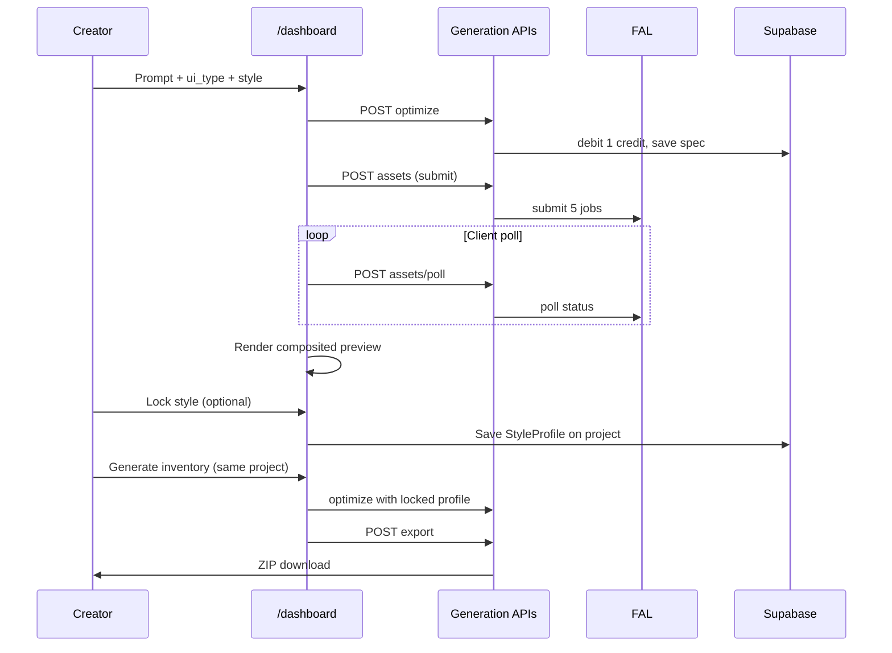

# Paid Launch — May 31 Production Promotion

## Summary

Land the large `develop` paid-launch update (auth, FAL pipeline, billing, dashboard workbench), then close three product gaps before **2026-05-31**: composited browser preview, style lock MVP, and template→dashboard activation. Promote `develop` to production with Lemon Squeezy + generation env vars configured, run the paid-launch QA checklist, and kick off distribution on June 1. Post-launch work targets **100 paying users** in Month 1–2 on the shipped USD catalog ($19 Starter / $49 Pro).

---

## Problem Frame

HUDForge on `develop` is ~20 commits ahead of `main` with substantial uncommitted work: authenticated SaaS generation, Lemon Squeezy billing, dashboard workbench, and marketing surfaces. Production still serves the older marketing-only build — SaaS routes 404. The strategy requirements (origin doc) demand workflow compression, style lock retention, live billing, and distribution-ready activation by May 31. The remaining work is not greenfield; it is **finish, verify, ship, and activate**.

---

## Requirements

- R1. Workflow compression: describe UI → preview → download usable export in one session (origin)
- R2. Structured deterministic export: layout + Luau + assets + import guide (origin)
- R3. Premium cyber-fantasy visual quality bar (origin)
- R4. Browser preview renders layout + generated assets well enough to trust export (origin)
- R5. Style lock after first generation within a project (origin)
- R6. Style-locked regenerations match locked palette and art direction (origin)
- R7. Paid plans + live checkout/webhook credit grants (origin)
- R8. 100 paying users Month 1–2 (origin — post-launch metric)
- R9. Distribution demonstrates real export workflows (origin)
- R10. Template gallery drives signup → first export (origin)
- R11. SaaS routes live on production by **2026-05-31** (origin)
- R12. Differentiate on structured export + style lock (origin)
- R13. Competitive positioning vs Bloxsmith (origin)

**Origin actors:** A1 Solo Roblox developer, A2 Small team lead, A3 Founder/operator, A4 Competing tools

**Origin flows:** F1 First successful export, F2 Style lock retention, F3 Paid conversion, F4 Distribution→activation

**Origin acceptance examples:** AE1 preview trust, AE2 ZIP structure, AE3 style lock consistency, AE4 billing grants, AE5 production funnel

---

## Scope Boundaries

### Deferred for later

- Roblox Studio plugin and automatic asset upload (origin)
- Adaptive mode matching existing in-game UI (origin)
- Shareable preview cards / watermark exports (origin)
- Long-form YouTube, press outreach (origin)
- Pay-as-you-go-only pricing model (origin)
- PNG bytes embedded inside ZIP (URLs + manual upload acceptable for v1)
- Team/Dev tier checkout ($200 catalog-only stays disabled)

### Outside this product's identity

- Unity/Unreal/Godot expansion (origin)
- General Roblox AI dev assistant (origin)
- Enterprise/studio tier (origin)
- Generic AI art without Roblox structure (origin)
- Template marketplace as primary product (origin)

### Deferred to Follow-Up Work

- Update strategy requirements doc GBP figures (£10/£30) to match shipped USD catalog — separate doc PR after launch
- Quest/faction template types not in generator `UiType` enum — add when demand signal appears

---

## Context & Research

### Current application state (verified 2026-05-26)

**Done on `develop` (committed + uncommitted working tree):**

| Area | Status | Evidence |
|------|--------|----------|
| Clerk auth + route protection | Done | `proxy.ts`, `lib/hudforge-auth.ts` |
| Generation pipeline (optimize → FAL submit/poll → export) | Done | `lib/hudforge-generation.ts`, `app/api/generate/*` |
| Dashboard workbench (no standalone `/generate`) | Done | `app/dashboard/page.tsx`, `app/generate/page.tsx` → redirect |
| Legacy Replicate + waitlist removal | Done (uncommitted) | Deleted `app/api/generate/route.ts`, `app/api/waitlist/route.ts`, `lib/generation.ts` |
| ZIP + Luau export | Done | `buildExportPackage()`, `test/hudforge-zip-export.test.ts` |
| Lemon Squeezy checkout/webhook/top-up/portal | Done | `app/api/billing/*`, `test/hudforge-lemon-squeezy.test.ts` |
| USD pricing $19/$49 + top-ups | Done | `billingPlans` in `lib/hudforge-generation.ts` |
| DeepSeek optimizer default | Done | OpenRouter + mock fallback |
| Plan-based queue priority | Done | `queue_tier` in workbench |
| Idempotency + recovery banner | Done | `GenerationWorkbench.tsx`, `test/hudforge-idempotency.test.ts` |
| Error boundaries | Done | `app/error.tsx`, `app/dashboard/error.tsx`, etc. |
| Marketing + legal + templates gallery | Done | `app/templates/*`, `legal/*`, `lib/marketing-content.ts` |
| Supabase persistence + atomic credits | Done | migrations, `debit_credits` RPC |

**Not done (blocks origin requirements):**

| Gap | Req | Notes |
|-----|-----|-------|
| Composited browser preview | R4, AE1 | Preview shows asset **names only**, not `asset.url` or `layout_spec` positions |
| Style lock | R5, R6, AE3 | Zero implementation — no `style_lock`, `project_id`, or inheritance |
| Template → dashboard prefill | R10, F4 | Template detail shows prompt seed but no "Use template" CTA with query params |
| Production deployment | R11, AE5 | `main` ~20 commits behind; smoke audit shows SaaS 404 on production |
| Lemon Squeezy prod config | R7, AE4 | Code ready; variant IDs + webhook secret need Vercel Production |
| Distribution channel activation | R9 | `/links` marks channels "Pending activation" |

**Pricing drift:** Origin strategy doc says £10/£30 (150/600 credits). Code and `docs/ops/paid-launch-fix-prompts.md` ship **$19/$49** (250/1000 credits). **Code is source of truth for launch**; update strategy doc separately.

### Relevant Code and Patterns

- Pipeline single source of truth: `lib/hudforge-generation.ts`
- Workbench UI: `components/generator/GenerationWorkbench.tsx`
- Workbench options: `lib/generation-workbench.ts`
- Template data: `lib/marketing-content.ts`, `app/templates/[id]/page.tsx`
- Paid launch runbook (prompts 1–19): `docs/ops/paid-launch-fix-prompts.md` — prompts 9–19 largely implemented in working tree; prompt map header is stale
- Production smoke baseline: `docs/wiki/production-smoke-audit.md`
- Distribution playbook: `docs/distribution-strategy.md`

### Institutional Learnings

- No `docs/solutions/` entries found.

### External References

- Origin: `docs/brainstorms/2026-05-25-hudforge-strategy-requirements.md`
- Competitor reference: Bloxsmith (Studio plugin + style presets) — HUDForge differentiates on structured export + style lock until plugin ships

---

## Key Technical Decisions

- **Pricing for launch uses USD $19/$49 from code**, not GBP figures in origin doc (see origin: pricing drift note).
- **Style lock model:** Introduce optional `project_id` on generations. After a successful export, creator can "Lock style" — persists a `StyleProfile` (palette hex values, style enum, art-direction summary, image_prompt modifiers) on the project. Subsequent generations with the same `project_id` inject locked profile into optimizer user prompt and FAL asset prompts. Explicit lock action after first export — not automatic on every generation.
- **Minimum viable preview:** Composited mobile ScreenGui canvas — render `layout_spec` nodes as positioned elements using `asset.url` images where mapped; fallback to asset thumbnails in a grid when layout mapping incomplete. Full pixel-perfect Roblox parity deferred.
- **Projects UX:** Reuse `/projects` as project list; group generations by `project_id`. First generation without project creates implicit default project; "Lock style" promotes to named project.
- **Template activation:** Template detail "Use this template" → `/dashboard?prompt=…&ui_type=…&style=…`; workbench reads searchParams on mount and pre-fills form.
- **May 31 scope cut:** Studio plugin, PNG-in-ZIP, and export watermark explicitly out; style lock MVP and preview are in.

---

## Open Questions

### Resolved During Planning

- **Style lock representation:** Per-project `StyleProfile` with explicit lock action after first export (origin deferred question).
- **Minimum viable preview:** Composited layout + asset URLs, not wireframe-only (origin deferred question).
- **Pricing for launch:** $19/$49 USD per `billingPlans` and paid-launch runbook, not £10/£30 (origin drift resolved in favor of code).

### Deferred to Implementation

- Exact `StyleProfile` JSON shape and Supabase column vs metadata storage — decide during U3 implementation
- Whether style lock requires Starter+ or is free-tier with generation credit cost — default: available to all signed-in users; Pro gets `style_tier: premium` prompt modifiers
- Which 3–5 UI types lead DevForum content — default: shop_ui, inventory, hud_overlay (highest strategy + template overlap)

---

## High-Level Technical Design

> *This illustrates the intended approach and is directional guidance for review, not implementation specification. The implementing agent should treat it as context, not code to reproduce.*



---

## Phased Delivery

### Phase A — Stabilize & verify (May 26–27)

Commit uncommitted paid-launch work; run full QA locally; fix any regressions from prompts 9–19.

### Phase B — Product gaps (May 27–29)

Ship composited preview (U2), style lock MVP (U3), template activation (U4).

### Phase C — Production promotion (May 29–31)

Configure Vercel Production env; merge `develop` → `main`; run production smoke + Lemon Squeezy QA (U5).

### Phase D — Distribution & revenue (June 1–July 31)

Execute distribution playbook; target 100 paying users (U6).

---

## Implementation Units

- U1. **Stabilize paid-launch working tree**

**Goal:** Commit and verify the large local update; align runbook with reality.

**Requirements:** R1, R2, R7, R11 (prerequisite)

**Dependencies:** None

**Files:**
- Modify: all uncommitted files on `develop` (see `git status`)
- Modify: `docs/ops/paid-launch-fix-prompts.md` (update prompt map: 9–18 → Done)
- Test: full `test/` suite

**Approach:**
- Review uncommitted diff against prompts 9–19 acceptance criteria in `docs/ops/paid-launch-fix-prompts.md`
- Fix any failing type-check, test, or build issues
- Commit with conventional message summarizing paid-launch IA + billing + pipeline hardening
- Do not merge to `main` until U2–U4 complete or explicitly scoped out

**Test scenarios:**
- Happy path: `npm run type-check`, `npm run test:run`, `npm run build` all pass
- Integration: legacy `POST /api/generate` returns 404; `/generate` redirects to `/dashboard`
- Happy path: no `waitlist` or `replicate` references in app runtime code

**Verification:**
- Clean CI-equivalent local run; working tree committed on `develop`

---

- U2. **Composited browser preview**

**Goal:** Creators see generated assets in a layout-faithful preview before export (R4, AE1).

**Requirements:** R3, R4, R1, AE1

**Dependencies:** U1

**Files:**
- Create: `components/generator/GenerationPreview.tsx`
- Modify: `components/generator/GenerationWorkbench.tsx`
- Modify: `lib/hudforge-generation.ts` (expose layout node → asset_ref mapping if needed)
- Test: `test/generator-preview.test.ts`

**Approach:**
- New `GenerationPreview` component accepts `optimized_spec.layout_spec` and `asset_bundle.assets`
- Map layout nodes to asset URLs via existing `asset_ref` fields in spec
- Render inside existing phone mockup frame: positioned frames/buttons/icons using layout coordinates scaled to preview viewport
- When assets still generating: show skeleton placeholders; when ready: swap in ``
- After `assets_ready`, set status to `preview_ready` in workbench before export step

**Patterns to follow:**
- Existing phone mockup shell in `GenerationWorkbench.tsx` (lines ~327–348)
- Brand palette from `assets/brand-guidelines.md`

**Test scenarios:**
- Covers AE1. Happy path: given layout_spec + 5 assets with URLs, preview renders at least main_frame and primary_button images
- Edge case: given assets without URLs (mock mode), preview shows labeled placeholders without broken images
- Edge case: given partial asset bundle (3/5), preview renders available assets and skeletons for missing

**Verification:**
- Signed-in user completing generation sees real PNG/SVG thumbnails in preview, not name-only cards

---

- U3. **Style lock MVP**

**Goal:** Creators lock visual identity after first export and regenerate consistent UI for additional screens (R5, R6, AE3).

**Requirements:** R5, R6, R12, F2, AE3

**Dependencies:** U1

**Files:**
- Create: `supabase/migrations/YYYYMMDD_hudforge_style_lock.sql`
- Modify: `lib/hudforge-generation.ts` (StyleProfile type, lock/unlock, prompt injection)
- Modify: `app/api/generations/route.ts` or new `app/api/projects/route.ts`
- Modify: `components/generator/GenerationWorkbench.tsx` (Lock style button, project selector)
- Modify: `components/app/ProjectsPanel.tsx` (show locked projects)
- Test: `test/hudforge-style-lock.test.ts`

**Approach:**
- Add `hudforge_projects` table: `id`, `user_id`, `name`, `style_profile` (jsonb), `locked_at`, `source_generation_id`
- Add optional `project_id` on `hudforge_generations`
- "Lock style" action (post-export): extract palette + style + art direction from `optimized_spec` into `StyleProfile`; save to project
- Subsequent optimize calls with `project_id`: append locked profile constraints to optimizer user prompt and FAL `buildFalAssetPrompt`
- Pro plan `style_tier: premium` adds stronger consistency modifiers; free/starter get basic lock
- UI: project dropdown on workbench; "Lock style" CTA after first successful export

**Technical design:** *(directional)*

```
StyleProfile {
  style: neon | cyber | ...
  palette: { primary, secondary, accent, background }
  art_direction: string
  image_prompt_suffix: string  // injected into all 5 asset prompts
}
```

**Test scenarios:**
- Covers AE3. Happy path: lock style from shop generation → generate inventory with same project_id → optimizer prompt contains locked palette; FAL prompts share suffix
- Edge case: generate without project_id behaves as today (no lock)
- Error path: lock style on failed generation → rejected with clear error
- Integration: two generations same project produce asset bundles referencing same palette values in spec metadata

**Verification:**
- Creator can lock style and produce a second UI type that visually coheres in preview and export metadata

---

- U4. **Template → dashboard activation funnel**

**Goal:** Template gallery drives qualified creators to first export (R10, F4).

**Requirements:** R9, R10, F4

**Dependencies:** U1

**Files:**
- Modify: `app/templates/[id]/page.tsx`
- Modify: `components/generator/GenerationWorkbench.tsx` (read URL search params)
- Modify: `lib/marketing-content.ts` (ensure template seeds match generator ui_type/style enums)
- Test: `test/template-activation.test.ts`

**Approach:**
- Add "Use this template" CTA on template detail → `/dashboard?prompt=…&ui_type=…&style=…` (URL-encoded)
- Workbench `useEffect` on mount: parse searchParams, pre-fill prompt/uiType/style
- Align template `ui_type` values with `generationUiTypeOptions` (map quest/faction templates to nearest supported type or extend enum minimally)
- Landing/pricing CTAs already point to `/sign-up` — verify post-sign-in redirect lands on `/dashboard` with Clerk config

**Test scenarios:**
- Happy path: template detail link produces dashboard with pre-filled prompt matching template seed
- Edge case: unsigned user clicks "Use template" → Clerk sign-up → returns to dashboard with params preserved (Clerk redirect URL config)
- Edge case: invalid query params fall back to workbench defaults without crash

**Verification:**
- DevForum-bound template links land on working generate flow, not static marketing dead-end

---

- U5. **Production promotion + Lemon Squeezy live**

**Goal:** SaaS routes live on `https://www.hudforge.app` by May 31 (R11, R7, AE4, AE5).

**Requirements:** R7, R11, AE4, AE5

**Dependencies:** U1, U2, U3, U4

**Files:**
- Modify: Vercel Production environment (manual — document in ops note)
- Modify: `docs/wiki/production-smoke-audit.md` (post-promotion results)
- Test: manual QA per `docs/ops/paid-launch-fix-prompts.md` checklist

**Approach:**
- Configure Vercel Production env vars (Clerk, Supabase service role, OpenRouter, FAL, Lemon Squeezy variants + webhook secret, Sentry) — list from Prompt 19 in paid-launch runbook
- Create Lemon Squeezy products in test mode first; run QA checklist items 1–9; switch to live mode before May 31
- Merge `develop` → `main`; verify Vercel production deploy
- Re-run smoke: `/dashboard`, `/billing`, `/api/billing/status`, `/api/generate/optimize` (401 unauthenticated, 200 authenticated)
- Register webhook URL: `https://www.hudforge.app/api/billing/webhook`

**Test scenarios:**
- Covers AE4. Integration: test-mode Starter checkout → +250 credits once; webhook replay → no duplicate
- Covers AE5. Integration: production `/dashboard` returns 200 for authenticated user; marketing `/templates` links to activation path
- Error path: missing Lemon Squeezy env → billing page shows "Checkout not configured" (not 500)

**Verification:**
- Production smoke audit updated with pass results; paid checkout grants credits; full generation loop works on production URL

---

- U6. **Distribution activation pack**

**Goal:** Turn on distribution channels and measure toward 100 paying users (R8, R9, success criteria).

**Requirements:** R8, R9, R10 (ongoing)

**Dependencies:** U5

**Files:**
- Modify: `app/links/page.tsx` (flip channels from Pending → Live with URLs)
- Modify: `docs/distribution-strategy.md` (add post-launch cadence start date)
- Create: `marketing/social-captions/` launch clips scripts (optional)
- External: DevForum post, X clips, Discord invite

**Approach:**
- June 1 start: 3 short clips/day for launch week per distribution strategy
- Publish DevForum post using `marketing/social-captions/roblox-devforum-post.txt` — update with live product URL and template links
- Founder outreach: 2–3 DMs/day to Roblox creators
- Track: landing conversion, signup→export rate, Starter/Pro mix, style-lock reuse rate
- KPI gates from origin: >8% landing conversion; 10 high-signal feedback replies; 3+ repeated UI type requests

**Test scenarios:**
- Test expectation: none — operational/distribution work, not code behavior

**Verification:**
- `/links` reflects live channel status; first week of content published with working production URLs

---

## System-Wide Impact

- **Interaction graph:** Style lock touches optimize + FAL prompt builders + generation metadata + projects UI. Preview touches workbench state machine only. Template prefill touches marketing → dashboard boundary.
- **Error propagation:** Style lock failures must not corrupt generation pipeline; lock action is separate API call with own error handling.
- **State lifecycle risks:** Idempotency keys and credit debits must remain correct when style lock injects longer prompts; verify no double-debit on lock-then-regenerate flow.
- **API surface parity:** New project/style-lock endpoints must use `requireHudforgeUser()` and match `hudforgeError()` patterns.
- **Integration coverage:** Production promotion requires end-to-end test on live URL — unit tests alone insufficient for U5.
- **Unchanged invariants:** ZIP structure, Luau determinism, webhook HMAC verification, Clerk protect list for billing webhook exclusion.

---

## Risks & Dependencies

| Risk | Mitigation |
|------|------------|
| May 31 slip with 3 net-new features (preview, style lock, template funnel) | U2 and U4 are 1–2 day each; U3 is largest — ship simplified lock (palette + style enum only) if time-constrained |
| Uncommitted work has hidden regressions | U1 full test suite before feature work |
| Lemon Squeezy misconfiguration double-grants or zero-grants | Test mode QA + idempotency tests already exist; manual checklist before live |
| Production deploy breaks marketing routes | Smoke audit both marketing and SaaS routes post-merge |
| Style lock quality insufficient vs GameUI AI | Inject strong image_prompt_suffix; iterate post-launch from creator feedback |
| 100 users in 60 days aggressive without audience | Distribution cadence + template SEO; adjust target if Week 2 conversion weak |

---

## Success Metrics

- **May 31:** Production serves full SaaS loop; Lemon Squeezy live; QA checklist 9/9 pass
- **Week 1 post-launch:** >50 signups; >30% complete at least one export; >8% landing conversion
- **Month 1–2:** 100 paying users (Starter + Pro); style-lock users generate ≥2 UI types per project
- **Competitive clarity:** Creator feedback mentions structured export or style consistency vs Bloxsmith plugin sync

---

## Documentation / Operational Notes

- Update `docs/ops/paid-launch-fix-prompts.md` prompt map after U1
- Record post-promotion smoke in `docs/wiki/production-smoke-audit.md`
- Update origin strategy doc pricing to USD in follow-up PR (out of launch scope)
- Vercel Production env checklist: see Prompt 19 in paid-launch runbook

---

## Sources & References

- **Origin document:** [docs/brainstorms/2026-05-25-hudforge-strategy-requirements.md](../brainstorms/2026-05-25-hudforge-strategy-requirements.md)
- Paid launch runbook: [docs/ops/paid-launch-fix-prompts.md](../ops/paid-launch-fix-prompts.md)
- Production smoke: [docs/wiki/production-smoke-audit.md](../wiki/production-smoke-audit.md)
- Distribution: [docs/distribution-strategy.md](../distribution-strategy.md)
- Pipeline: [lib/hudforge-generation.ts](../../lib/hudforge-generation.ts)
- Workbench: [components/generator/GenerationWorkbench.tsx](../../components/generator/GenerationWorkbench.tsx)
